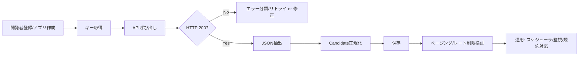

# 楽天市場とYahooショッピングの公式商品検索APIで商品一覧を自動取得するPoCと運用注意点

## エグゼクティブサマリ

楽天側は、**新ドメイン `openapi.rakuten.co.jp` への移行が必須**で、旧ドメイン `app.rakuten.co.jp` と旧APIバージョンは **2026-05-14 以降停止**（移行期限は 2026-05-13）というアナウンスが出ています。既存実装が旧ドメイン/旧キー/旧バージョンに依存している場合、CBS-MVPのPoCでも該当日に取得が止まるので、最初から新ドメイン + 最新バージョンで作るのが安全です。citeturn16view0turn45view0

楽天の「楽天市場商品検索（Ichiba Item Search）」は、最新ドキュメント上は **version: 2022-06-01** が現行で、`applicationId` に加えて **`accessKey`（Authorization: Bearer … あるいはクエリ）**が必須です。レスポンス形式改善の `formatVersion=2` を使うと `items[0].itemName` のように扱えてパースが楽です。citeturn44view0  
運用面では「**1 application_id あたり 1秒に1回以下**」という明示的な制限があり、さらに**価格/在庫等のキャッシュは24時間、その他は3か月**など、保存・更新ルールも日本語FAQで明記されています。citeturn31view0turn34view0

Yahooショッピング側は、**商品検索（v3）** のリクエストURLが `https://shopping.yahooapis.jp/ShoppingWebService/V3/itemSearch`（JSONのみ）で、認証は基本的に **`appid`（Client ID）をクエリに付与**します。ページングは `start` と `results` を使い、**`start + results <= 1000`** という上限があります。citeturn18view0turn41view0  
利用制限は、告知で **「1分間で30リクエスト（アプリケーションIDごと）」** に変更された旨が示されています（429）。citeturn20view0  
また、v3のドキュメントから参照される「Yahoo!ショッピング出店API 利用約款」には、**APIで提供された情報を“保持しない”**趣旨の条文が含まれるため、CBS-MVPに保存する設計は「保存する内容を最小化し、必要なときに再取得する」など、規約リスクを意識した構成に寄せる必要があります。citeturn43view0  
（※Yahooの“商用利用一般”ページは参照リンクがあるものの、本調査環境では本文が取得できず、未指定扱いにしています。）

---

## 優先タスクとPoCの全体像

### 優先タスクの順序

以下は「PoCで“商品一覧が自動取得できた”」を最速で確認するための順番です（楽天・Yahoo共通の型）。

1. **開発者登録 → アプリ作成**
2. **キー取得（楽天：applicationId + accessKey、Yahoo：appid）**
3. **APIをcurlで叩いて疎通確認（200 / JSONが返る）**
4. **JSONから必須フィールド抽出（タイトル・価格・URL・画像・在庫）**
5. **保存（DB or JSONL）**
6. **ページング確認（2ページ目が取れる）**
7. **レート制限・規約に沿う形に調整（キャッシュ、更新頻度、クレジット表示）**

### 全体フロー（mermaid）



---

## entity["organization","楽天ウェブサービス","rakuten developer platform"]のIchiba Item Search PoC

### 開発者登録・キー取得の具体手順

楽天は 2026-02-10 の告知で「アプリ再登録」「新ドメイン移行」「最新APIバージョン利用」が必須とされ、移行期限は 2026-05-13 です。citeturn16view0  
PoCでも、**必ず新アプリで発行した新しい認証情報**を使う前提にします。

手順イメージ（画面名はガイドに準拠）：
- Rakutenアカウントでログインし、アプリを登録して **applicationId と accessKey** を取得します（アプリ登録に必要な項目例：Application name / URL / type / allowed websites / purpose / expected QPS 等）。citeturn17view0
- 取得した `accessKey` は **HTTPヘッダー `Authorization: Bearer {accessKey}`** で使う（またはクエリに `accessKey` を付与）。アプリID（`applicationId`）とセットで必須です。citeturn44view0

### 最新エンドポイント・認証方法

**最新エンドポイント（version: 2022-06-01）**
```text
https://openapi.rakuten.co.jp/ichibams/api/IchibaItem/Search/20220601
```
エンドポイントが `openapi.rakuten.co.jp` である点は、移行告知でも明示されています。citeturn16view0turn44view0

**認証（必須）**
- `applicationId`（必須）
- `accessKey`（必須）：  
  - ヘッダー `Authorization: Bearer {accessKey}` または  
  - クエリ `accessKey=...`  
  のどちらかで提供できる、とドキュメントに記載されています。citeturn44view0

### 必須/推奨パラメータ

**必須**
- `applicationId`
- `accessKey`（ヘッダー or パラメータ）
- 検索条件：`keyword` / `genreId` / `itemCode` / `shopCode` のうちいずれか（「いずれか必須」と注記あり）citeturn44view0

**推奨（PoC向け）**
- `format=json`
- `formatVersion=2`（パース簡略化：`items[0].itemName` 形式になる）citeturn44view0
- `hits`（1〜30、デフォルト30）citeturn44view0
- `page`（1〜100）citeturn44view0turn40view0
- `elements`（必要なフィールドだけ返す：転送量・パースコスト・保存規約リスクを下げやすい）citeturn44view0
- `affiliateId`（アフィリエイトURLをレスポンスに含めたい場合）citeturn40view0turn44view0

### curlサンプル

```bash
# env:
#  RAKUTEN_APP_ID=...
#  RAKUTEN_ACCESS_KEY=...
#  RAKUTEN_AFFILIATE_ID=...   # 任意

curl -sS -G 'https://openapi.rakuten.co.jp/ichibams/api/IchibaItem/Search/20220601' \
  -H "Authorization: Bearer ${RAKUTEN_ACCESS_KEY}" \
  --data-urlencode "applicationId=${RAKUTEN_APP_ID}" \
  --data-urlencode "keyword=nike" \
  --data-urlencode "hits=10" \
  --data-urlencode "page=1" \
  --data-urlencode "format=json" \
  --data-urlencode "formatVersion=2" \
  --data-urlencode "affiliateId=${RAKUTEN_AFFILIATE_ID}" \
  --data-urlencode "elements=itemName,itemCode,itemPrice,itemUrl,affiliateUrl,mediumImageUrls,shopName,shopCode,availability,postageFlag,taxFlag,reviewAverage,reviewCount"
```

注：`keyword` や `sort` の値はUTF-8でURLエンコードする必要がある旨が記載されています（curlの `--data-urlencode` を使うと安全）。citeturn44view0

### 典型レスポンス抜粋（JSON例）

`formatVersion=2` のときの構造は「items配列の要素がそのまま itemName 等を持つ」形式です。citeturn44view0  
例（構造理解用の簡略例）：

```json
{
  "count": 12345,
  "page": 1,
  "hits": 10,
  "pageCount": 100,
  "items": [
    {
      "itemName": "…",
      "itemCode": "shop:123456",
      "itemPrice": 10450,
      "taxFlag": 0,
      "postageFlag": 0,
      "availability": 1,
      "itemUrl": "https://…",
      "affiliateUrl": "https://…",
      "mediumImageUrls": ["https://…"],
      "shopName": "…",
      "shopCode": "…",
      "reviewAverage": 4.3,
      "reviewCount": 100
    }
  ]
}
```

### 取得可能フィールド一覧（ドキュメント準拠）

ドキュメントの「Output Parameters」より、主要フィールドは以下です。citeturn40view0

| 区分 | フィールド（JSONパス/パラメータ名） | 概要 |
|---|---|---|
| 検索共通 | `count` / `page` / `first` / `last` / `hits` / `carrier` / `pageCount` | ヒット件数、ページング情報等 |
| 商品 | `itemName` / `catchcopy` / `itemCode` / `itemPrice` / `itemCaption` / `itemUrl` | 商品名、コード、価格、説明、URL |
| 価格レンジ | `itemPriceBaseField` / `itemPriceMax1..3` / `itemPriceMin1..3` | 価格の種別・最大/最小 |
| アフィリエイト | `affiliateUrl`（`affiliateId` 指定時）/ `affiliateRate` | アフィリエイトURL・料率 |
| 画像 | `imageFlag` / `smallImageUrls[]` / `mediumImageUrls[]` | 画像有無・画像URL（最大3件） |
| 在庫・条件 | `availability` / `taxFlag` / `postageFlag` / `creditCardFlag` / `giftFlag` | 在庫、税込/税抜、送料、カード、ギフト等 |
| 海外配送等 | `shipOverseasFlag` / `shipOverseasArea` / `asurakuFlag` / `asurakuClosingTime` / `asurakuArea` | 海外配送、翌日配送系 |
| セール期間 | `startTime` / `endTime` | タイムセール期間 |
| レビュー | `reviewCount` / `reviewAverage` | レビュー件数・平均 |
| ポイント | `pointRate` / `pointRateStartTime` / `pointRateEndTime` | 商品別ポイント倍率等 |
| 店舗 | `shopName` / `shopCode` / `shopUrl` / `shopAffiliateUrl` | 店舗名、店舗コード、URL |
| ジャンル/タグ | `genreId` / `tagIds[]` | ジャンルID、タグID（配列） |
| ジャンル集計 | `genreInformation`（parent/current/child配下に `genreId/genreName/itemCount/genreLevel` 等） | ジャンル別件数（フラグ指定時） |
| タグ集計 | `tagInformation`（`tagGroupName/tagGroupId/tags[]` 等、`tagId/tagName/parentTagId/itemCount`） | タグ別件数（フラグ指定時） |

### レート制限・保存/表示ルール（公式優先）

**レート制限**
- 1つの `application_id` あたり **「1秒に1回以下」** が明記されています。citeturn31view0
- 制限緩和は受け付けない旨も明記されています。citeturn32view0
- 超過が“瞬間”で即停止ではないが、**継続的超過で利用停止になり得る**とされています。citeturn33view0

**キャッシュ・更新頻度（重要：保存設計に直結）**
- 価格/販売可能情報のキャッシュ：**24時間**
- その他情報のキャッシュ：**3か月**citeturn34view0  
- 価格/販売可能情報を表示する場合は **少なくとも週1回はAPIから再取得して刷新**。citeturn34view0  
- 1時間に1回以上更新しない場合、**更新日時の表示**と免責文の掲載が必要（免責文の例もFAQ内に明記）。citeturn34view0

**クレジット表示**
- 楽天側もブランディング表示のガイドがあり、バッジ表示・HTML改変禁止等が示されています（違反時はAPI停止の可能性）。citeturn6view0

**商用利用・再配布周り（要注意）**
- 規約（英語ページだが“日本語が優先”と明記）には、楽天アフィリエイト以外での収益化や、取得情報の不適切利用・共有可能な場所への保存などの禁止が含まれます。citeturn30search7  
（未指定：どの保存形態が「共有可能な場所」に当たるか等、個別判断はFAQで「個別確認はできない」趣旨があり得るため、プロダクト要件に応じてリーガルレビュー推奨。）

### エラーケースと対処（楽天）

ドキュメント上、典型例として以下が示されています。citeturn40view0turn44view0

| HTTP | 典型原因 | 対処 |
|---|---|---|
| 400 | 必須パラメータ不足、値不正（例：applicationId不正、keyword不正 等） | **リトライせず**入力を修正。ログに“どのパラメータ”か残す |
| 404 | データ無し | 正常系として扱う（0件） |
| 429 | リクエスト超過 | 指数バックオフ + ジッターで再試行、**1rps以下**に抑制 |
| 旧バージョン呼び出し | 2026-05-13廃止対象のURLなど | 400で `API Configuration not found` になり得るciteturn45view0 |

---

## entity["organization","Yahoo!デベロッパーネットワーク","japanese api portal"]のYahooショッピング商品検索（v3）PoC

### 開発者登録・Client ID取得の具体手順

商品検索（情報取得系）APIは「Yahoo! ID連携不要」枠ですが、**Client ID（appid）は必要**です。citeturn28view0turn18view0

導入フローの公式ページでは、少なくとも以下が案内されています（本来はストア運営APIも含むフローだが、PoCでは “Yahoo! JAPAN ID取得 → アプリ登録” を使う）。citeturn29view0
- Yahoo! JAPAN IDを取得
- アプリケーション登録（Client ID発行）citeturn29view0

補足：FAQには、`insufficient_scope` のような認証エラー時に「アプリの権限（スコープ）を確認し、必要なら新しいアプリケーションを取得」といった説明があります。citeturn19view0

### 最新エンドポイント・認証方法

**リクエストURL（v3 / JSONのみ）**citeturn18view0
```text
https://shopping.yahooapis.jp/ShoppingWebService/V3/itemSearch
```

**認証**：クエリに `appid=<Client ID>` を付与（必須）。citeturn18view0  
（参考：ストア運営系APIはOAuthアクセストークンを使うが、本PoCの“商品検索（v3）”はURLパラメータの `appid` が基本。citeturn28view0turn18view0）

### 必須/推奨パラメータ

**必須**
- `appid`citeturn18view0

**検索条件（代表）**
- `query`（キーワード）
- `jan_code`
- `genre_category_id`
- `brand_id`
- `seller_id`  
これらで検索できる旨が説明されています。citeturn18view0  
（未指定：上記のうち“どれか1つは必須”のような明示文は、取得できた範囲では見当たりませんでした。PoCでは `query` を必須扱いにするのが無難です。）

**ページング・件数**
- `results`（返却数、デフォルト20）
- `start`（先頭位置、デフォルト1、**`start + results <= 1000`** 上限）citeturn41view0

**絞り込み（PoCで使い勝手が良い）**
- `in_stock`（在庫ありのみ等）
- `price_from` / `price_to`
- `sort`（おすすめ順、価格順、レビュー数順 等）citeturn41view0
- `image_size`（`exImage` のサイズ制御）citeturn18view0

### curlサンプル

```bash
# env:
#  YAHOO_APP_ID=...

curl -sS -G 'https://shopping.yahooapis.jp/ShoppingWebService/V3/itemSearch' \
  --data-urlencode "appid=${YAHOO_APP_ID}" \
  --data-urlencode "query=nike" \
  --data-urlencode "results=5" \
  --data-urlencode "start=1" \
  --data-urlencode "in_stock=true" \
  --data-urlencode "sort=-score"
```

### 典型レスポンスの抜粋（JSON例）

公式ページには `query=nike` の例が掲載されています（以下は構造理解のための抜粋イメージ）。citeturn42view0

```json
{
  "totalResultsAvailable": 513766,
  "totalResultsReturned": 5,
  "firstResultPosition": 1,
  "request": { "query": "nike" },
  "hits": [
    {
      "index": 1,
      "name": "…",
      "url": "https://store.shopping.yahoo.co.jp/…",
      "code": "seller_managed_item_id",
      "inStock": true,
      "price": 10450,
      "image": { "small": "…", "medium": "…" },
      "seller": { "sellerId": "…", "name": "…" }
    }
  ]
}
```

### 取得可能フィールド一覧（v3ドキュメントで列挙される範囲）

v3の「レスポンスフィールド」節から、主要フィールドは以下です。citeturn41view0turn42view0

| 区分 | フィールド（JSONパス） | 概要 |
|---|---|---|
| 検索共通 | `totalResultsAvailable` / `totalResultsReturned` / `firstResultsPosition` / `request.query` | 件数、先頭位置、検索クエリ |
| 商品（基本） | `hits[].index` / `hits[].name` / `hits[].description` / `hits[].headLine` / `hits[].url` / `hits[].code` / `hits[].condition` / `hits[].inStock` | タイトル、説明、URL、商品コード、状態、在庫 |
| 価格（基本/会員） | `hits[].price` / `hits[].premiumPrice` / `hits[].taxExcludePrice` / `hits[].taxExcludePremiumPrice` / `hits[].premiumDiscountType` / `hits[].premiumDiscountRate` | 価格、会員価格、税抜など |
| 価格ラベル | `hits[].priceLabel.*`（`taxable`, `defaultPrice`, `discountedPrice`, `fixedPrice`, `periodStart`, `periodEnd`, 税抜系など） | 税込/税抜、通常/セール/定価、期間 |
| 画像 | `hits[].imageId` / `hits[].image.small` / `hits[].image.medium` / `hits[].exImage.url/width/height` | 画像URL、指定サイズ画像 |
| レビュー | `hits[].review.rate` / `hits[].review.count` / `hits[].review.url` | 平均、件数、URL |
| アフィリエイト | `hits[].affiliateRate` | 料率 |
| 送料 | `hits[].shipping.code` / `hits[].shipping.name` | 送料条件（例：送料無料 等） |
| カテゴリ | `hits[].genreCategory.id/name/depth` / `hits[].parentGenreCategories[]` | ジャンルカテゴリ、親カテゴリ |
| ブランド | `hits[].brand.id/name` / `hits[].parentBrands[]` | ブランド |
| JAN等 | `hits[].janCode` / `hits[].releaseDate` / `hits[].payment` | JAN、発売日、支払いコード |
| ストア | `hits[].seller.sellerId/name/url/isBestSeller` / `hits[].seller.review.*` / `hits[].seller.imageId` | ストア情報 |
| 配送条件 | `hits[].delivery.area/deadLine/day` | 都道府県、締め時間、配送日数 |

### 利用制限・規約（保存・再配布に直結）

**レート制限**
- 重要なお知らせで、商品検索（v3）は **「アプリケーションIDごとに 1分間で30リクエスト」** に変更（HTTP 429）とされています。citeturn20view0  
- v3ドキュメント内にも「同一URLに短時間で大量アクセスすると一定時間利用不可（1クエリ/秒）」と注記があります。citeturn42view0turn28view0  
→ PoC/運用は **“より厳しい方（30/min）” を基準**に作るのが安全です。

**クレジット表示（必須）**
- Yahoo側は、API利用サイト/アプリにクレジット表示が必要で、**規定HTMLの改変禁止**、規定位置、リンク要件が明示されています。citeturn21view1  
- ガイドライン上も、クレジット表示ルール順守が特約事項として触れられています。citeturn21view0  

**保存・保持の制約（要注意）**
- v3ドキュメントから参照される「Yahoo!ショッピング出店API 利用約款」では、**APIで提供される情報を（別途保管指示があるものを除き）保持しない**旨、また購入者の個人情報を保持しない旨が規定されています。citeturn43view0  
  - この条文が“商品検索（v3）の商品情報”にも及ぶ前提で読むなら、CBS-MVPで「商品詳細を長期保存して独自DB化」する設計はリスクが上がります。  
  - PoCでは「**商品コード + 取得日時 + 最小限の表示用フィールド**」に留め、必要時に再取得する構成が無難です（後述のCandidate正規化で“保存最小化モード”を用意）。

**商用利用**
- ショッピングのトップ説明に「アフィリエイトによるマネタイズに活用できる」と記載があります。citeturn28view0  
- 一方で、一般的な“WebAPIの商用利用について”解説ページは参照リンクがあるものの、当環境では本文取得できず（JavaScript必須で失敗）、未指定。citeturn28view0turn42view0  
→ **少なくとも「アフィリエイト導線を含むコンテンツ強化」は想定利用**と読み取れるが、厳密には各約款・ガイドラインに沿って設計する必要があります。

### エラーケースと対処（Yahoo）

v3ドキュメント上、商品検索で返りうるコードとして 429 が明示され、共通エラーも返すとされています。citeturn42view0  
共通のHTTPステータス説明（400/401/403/404/500/503等）は別ページで整理されています。citeturn25search6

| HTTP | 典型原因 | 対処 |
|---|---|---|
| 400 | パラメータ不正 | リトライせず修正 |
| 401/403 | appid不正、権限不足、利用制限等 | appid確認、権限/スコープ確認、規約違反の可能性も点検citeturn19view0turn25search6 |
| 429 | レート制限 | バックオフ + レート制御（30/min を基準）citeturn20view0turn42view0 |
| 5xx/503 | サーバ側 | 指数バックオフ、上限回数で諦めて後で再試行 |

---

## CBS-MVPのCandidateに取り込む正規化ルールとマッピング

### Candidate取り込みの基本方針

保存・表示制約がAPIごとに異なるため、Candidateは **「保存を最小化するモード」**を持つのが安全です。

- **必須（Candidate最小セット）**  
  `source`（RAKUTEN / YAHOO） / `sourceItemKey`（重複判定キー） / `title` / `itemUrl` / `price.amount` / `price.currency` / `retrievedAt`
- **推奨（出品候補判断に効く）**  
  `imageUrls[]` / `inStock` / `shopName` / `taxIncluded` / `shippingType` / `reviewAverage` / `reviewCount` / `points`（あれば）

楽天はキャッシュ許容期間が明示されている一方、Yahooの約款は“保持しない”趣旨が強いので、**Yahoo側Candidateは raw保存を避け、必要時に再取得**する運用寄りが無難です。citeturn34view0turn43view0

### 重複判定キー（推奨）

| ソース | 推奨キー（Candidate.sourceItemKey） | 根拠/理由 |
|---|---|---|
| 楽天 | `rakuten:{itemCode}` | `itemCode` が出力に含まれるciteturn40view0turn44view0 |
| Yahoo | `yahoo:{sellerId}:{code}` | `hits[].seller.sellerId` と `hits[].code` が出力に含まれるciteturn42view0 |

### 価格の扱い（税/送料/ポイント）

- 楽天：`taxFlag`（税込/税抜）と `postageFlag`（送料込み/別）が返る。citeturn40view0  
- Yahoo：`price` と `taxExcludePrice` 等があり、送料は `shipping.code` で取得可能。citeturn42view0turn41view0  
- ポイント：楽天は `pointRate`（倍率）系、Yahooは `hits.point.*` が多層で、制度変更注記もあるため「必要最低限だけ保存」がおすすめ。citeturn40view0turn42view0  

### JSON → Candidate マッピング表（例）

| Candidateフィールド | 楽天（formatVersion=2） | Yahoo（v3） | 変換ルール |
|---|---|---|---|
| `source` | `"RAKUTEN"` | `"YAHOO_SHOPPING"` | 固定 |
| `sourceItemKey` | `rakuten:{itemCode}` | `yahoo:{seller.sellerId}:{code}` | 上記キー生成 |
| `title` | `itemName` +（必要なら）`catchcopy` | `hits[].name` | 楽天はドキュメント上「通常名はcatchcopy+itemName推奨」citeturn40view0 |
| `itemUrl` | `itemUrl` | `hits[].url` | そのまま |
| `affiliateUrl` | `affiliateUrl`（affiliateId指定時） | （未指定：v3で“成果URL”が返る明示は取得範囲では確認できず） | 楽天は `affiliateId` 入力時に `affiliateUrl` が返るciteturn40view0turn44view0 |
| `price.amount` | `itemPrice` | `hits[].price` | JPY整数として保存 |
| `price.currency` | `"JPY"` | `"JPY"` | 固定 |
| `taxIncluded` | `taxFlag == 0` | `priceLabel.taxable`（nullあり） | Yahooは nullable があり得るため tri-state で保持推奨citeturn42view0 |
| `shippingType` | `postageFlag==0 ? "INCLUDED" : "EXCLUDED"` | `shipping.code`（2=FREE,3=CONDITIONAL…） | Yahooの送料条件コードに合わせてenum化citeturn42view0turn40view0 |
| `inStock` | `availability==1` | `hits[].inStock` | そのままciteturn40view0turn42view0 |
| `imageUrls[]` | `mediumImageUrls[]`（最大3） | `image.medium` +（任意）`exImage.url` | 重複除去して配列化citeturn40view0turn42view0 |
| `shop.name` | `shopName` | `seller.name` | そのままciteturn40view0turn42view0 |
| `shop.code` | `shopCode` | `seller.sellerId` | そのままciteturn40view0turn42view0 |
| `review.avg` | `reviewAverage` | `review.rate` | 数値 |
| `review.count` | `reviewCount` | `review.count` | 数値 |
| `retrievedAt` | 取得時刻 | 取得時刻 | UTCで統一 |
| `raw.mode` | `"FULL"`（楽天はキャッシュ条件が明示） | `"MINIMAL"`（保持制約が強い） | 楽天：価格24h/その他3か月等を反映citeturn34view0turn43view0 |

---

## 実装サンプル・検証手順・運用設計

### PoC成功条件と検証手順

**共通の成功条件**
- 200でJSONが返る
- 1ページ目で **N件以上（例：5件）** の items/hits が返る
- 各要素から `title / price / url / image(任意)` が抽出できる
- ページングが成立（楽天：`page=2`、Yahoo：`start` を進める）

**楽天（検証）**
- `formatVersion=2` で `items[0].itemName` が取れること（`formatVersion=1` との差を確認）citeturn44view0
- `hits=10&page=1` と `hits=10&page=2` でアイテムが変わること
- 取得結果を保存し、**価格/在庫表示をするなら更新ルール**（週1以上、キャッシュ24h等）を満たせる設計にするciteturn34view0

**Yahoo（検証）**
- `results=5&start=1` と `results=5&start=6` で items が変わること（`start+results<=1000` 範囲で）citeturn41view0turn42view0
- 429 が返る条件を再現できるなら、30/min を超えない制御で再現しないことを確認citeturn20view0

### リトライ方針（指数バックオフ）

推奨ポリシー（楽天/Yahoo共通）：
- **429**：指数バックオフ + ジッター（例：1s → 2s → 4s → 8s、最大60s）  
  - レート制限値（楽天 1rps、Yahoo 30/min）を超えないトークンバケットを併用citeturn31view0turn20view0
- **5xx/503**：同様にバックオフで最大3回程度
- **400/401/403**：基本リトライしない（資格情報・権限・規約・パラメータを見直す）citeturn25search6turn19view0
- **JSONパースエラー**：レスポンスボディを短縮ログ（サイズ上限）に残し、再試行は1回まで（異常が続くなら停止）

### セキュリティ/運用（キー管理・監視・ログ）

- APIキーは環境変数直置きではなく、Secrets Manager相当へ（少なくとも `git` コミット禁止、マスクログ必須）。
- ログは「HTTPステータス、レイテンシ、レート制御待ち時間、sourceItemKey、取得件数」まで。`accessKey` / `appid` は出さない。
- 監視：429比率、1分あたりリクエスト数、保存失敗（DBエラー）をメトリクス化。
- 変更耐性：楽天は移行イベントが現実に発生しているため、**ドメイン/バージョン/キーの差し替えを設定で可能にする**（2026-05-13/14周り）。citeturn16view0turn45view0

### Java最小実装例（HttpClient + Jackson）

> 目的：楽天とYahooの商品検索を1回ずつ叩き、Candidate最小セットを標準出力（または保存層へ渡す）  
> 依存：`com.fasterxml.jackson.core:jackson-databind`

```java
import com.fasterxml.jackson.databind.JsonNode;
import com.fasterxml.jackson.databind.ObjectMapper;

import java.net.URI;
import java.net.URLEncoder;
import java.net.http.HttpClient;
import java.net.http.HttpRequest;
import java.net.http.HttpResponse;
import java.nio.charset.StandardCharsets;
import java.time.Instant;
import java.util.ArrayList;
import java.util.List;

public class ShoppingSearchPoc {

    record Candidate(
            String source,
            String sourceItemKey,
            String title,
            long priceJpy,
            String itemUrl,
            List<String> imageUrls,
            Instant retrievedAt
    ) {}

    private static final ObjectMapper MAPPER = new ObjectMapper();
    private static final HttpClient HTTP = HttpClient.newHttpClient();

    public static void main(String[] args) throws Exception {
        var rakutenAppId = mustEnv("RAKUTEN_APP_ID");
        var rakutenAccessKey = mustEnv("RAKUTEN_ACCESS_KEY");
        var yahooAppId = mustEnv("YAHOO_APP_ID");

        List<Candidate> r = fetchRakuten(rakutenAppId, rakutenAccessKey, "nike", 5, 1);
        System.out.println("Rakuten candidates=" + r.size());
        r.forEach(System.out::println);

        // Yahooは“保持しない”趣旨の約款があるため、PoC段階でも保存は最小化し、必要なら再取得設計に寄せるのが安全。
        List<Candidate> y = fetchYahoo(yahooAppId, "nike", 5, 1);
        System.out.println("Yahoo candidates=" + y.size());
        y.forEach(System.out::println);
    }

    static List<Candidate> fetchRakuten(String appId, String accessKey, String keyword, int hits, int page) throws Exception {
        // formatVersion=2 で items[0].itemName 形式になる（パースが簡単）
        String base = "https://openapi.rakuten.co.jp/ichibams/api/IchibaItem/Search/20220601";
        String qs = "applicationId=" + enc(appId)
                + "&keyword=" + enc(keyword)
                + "&hits=" + hits
                + "&page=" + page
                + "&format=json"
                + "&formatVersion=2"
                // elements で必要最小限に絞る（転送量・保存リスクを減らす）
                + "&elements=" + enc("itemName,itemCode,itemPrice,itemUrl,mediumImageUrls,shopCode");

        HttpRequest req = HttpRequest.newBuilder()
                .uri(URI.create(base + "?" + qs))
                .header("Authorization", "Bearer " + accessKey)
                .GET()
                .build();

        HttpResponse<String> res = HTTP.send(req, HttpResponse.BodyHandlers.ofString());
        if (res.statusCode() == 429) throw new RuntimeException("Rakuten rate limited (429)");
        if (res.statusCode() != 200) throw new RuntimeException("Rakuten HTTP " + res.statusCode() + ": " + shrink(res.body()));

        JsonNode root = MAPPER.readTree(res.body());
        Instant now = Instant.now();

        List<Candidate> out = new ArrayList<>();
        for (JsonNode item : root.path("items")) {
            String itemCode = item.path("itemCode").asText("");
            String key = "rakuten:" + itemCode;
            String title = item.path("itemName").asText("");
            long price = item.path("itemPrice").asLong(0);
            String url = item.path("itemUrl").asText("");

            List<String> images = new ArrayList<>();
            for (JsonNode img : item.path("mediumImageUrls")) {
                images.add(img.asText());
            }

            if (!title.isBlank() && price > 0 && !url.isBlank() && !itemCode.isBlank()) {
                out.add(new Candidate("RAKUTEN", key, title, price, url, images, now));
            }
        }
        return out;
    }

    static List<Candidate> fetchYahoo(String appId, String query, int results, int start) throws Exception {
        String base = "https://shopping.yahooapis.jp/ShoppingWebService/V3/itemSearch";
        String qs = "appid=" + enc(appId)
                + "&query=" + enc(query)
                + "&results=" + results
                + "&start=" + start;

        HttpRequest req = HttpRequest.newBuilder()
                .uri(URI.create(base + "?" + qs))
                .GET()
                .build();

        HttpResponse<String> res = HTTP.send(req, HttpResponse.BodyHandlers.ofString());
        if (res.statusCode() == 429) throw new RuntimeException("Yahoo rate limited (429)");
        if (res.statusCode() != 200) throw new RuntimeException("Yahoo HTTP " + res.statusCode() + ": " + shrink(res.body()));

        JsonNode root = MAPPER.readTree(res.body());
        Instant now = Instant.now();

        List<Candidate> out = new ArrayList<>();
        for (JsonNode hit : root.path("hits")) {
            String sellerId = hit.path("seller").path("sellerId").asText("");
            String code = hit.path("code").asText("");
            String key = "yahoo:" + sellerId + ":" + code;

            String title = hit.path("name").asText("");
            long price = hit.path("price").asLong(0);
            String url = hit.path("url").asText("");

            List<String> images = new ArrayList<>();
            String img = hit.path("image").path("medium").asText("");
            if (!img.isBlank()) images.add(img);

            if (!title.isBlank() && price > 0 && !url.isBlank() && !sellerId.isBlank() && !code.isBlank()) {
                out.add(new Candidate("YAHOO_SHOPPING", key, title, price, url, images, now));
            }
        }
        return out;
    }

    static String enc(String s) {
        return URLEncoder.encode(s, StandardCharsets.UTF_8);
    }

    static String mustEnv(String key) {
        String v = System.getenv(key);
        if (v == null || v.isBlank()) throw new IllegalStateException("Missing env: " + key);
        return v;
    }

    static String shrink(String body) {
        if (body == null) return "";
        return body.length() <= 500 ? body : body.substring(0, 500) + "...(truncated)";
    }
}
```

### 実行可能チェックリストと想定所要時間

| ステップ | やること | 成功条件 | 想定時間 |
|---|---|---|---|
| キー準備（楽天） | 新アプリ登録→ `applicationId/accessKey` 取得（移行前提）citeturn16view0turn44view0 | キーが手元にある | 20〜60分 |
| キー準備（Yahoo） | アプリ登録→ `appid` 取得citeturn29view0turn18view0 | appidが手元にある | 15〜45分 |
| curl疎通（楽天） | `formatVersion=2` で1ページ取得citeturn44view0 | 200 + items>=1 | 10〜20分 |
| curl疎通（Yahoo） | `results/start` で取得citeturn41view0 | 200 + hits>=1 | 10〜20分 |
| ページング検証 | 楽天 `page=2` / Yahoo `start` を進める | 結果が変わる | 15〜30分 |
| JSON抽出 | title/price/url/image を抽出 | 欠損率が低い | 30〜90分 |
| 保存（PoC） | JSONL/DBに保存（UPSERT） | 重複が増えない | 60〜120分 |
| レート対策 | 楽天 1rps、Yahoo 30/min を上限に制御citeturn31view0turn20view0 | 429が出ない | 30〜90分 |
| 規約対応 | クレジット表示、キャッシュ/更新頻度のルールを設計へ反映citeturn21view1turn34view0turn43view0 | 運用ポリシーが決まる | 60〜180分 |

不明点（未指定）：
- Yahooの“商品検索（v3）での商品情報キャッシュ許容期間”は、v3ページ・告知・参照約款（保持しない趣旨）からは“許容期間の明文化”としては確認できませんでした（約款の解釈問題として残る）。citeturn43view0turn42view0